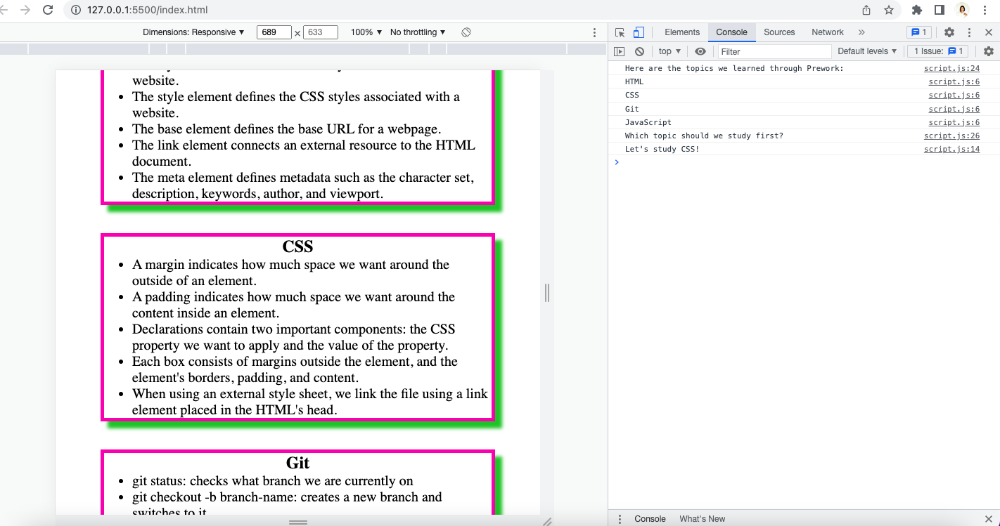

  # Prework Study Guide Webpage
Boot Camp Prework Study Guide For Students

# <Your-Project-Title>

## Description

Boot Camp Prework Study Guide was created for boot camp students who were going through the Prework. It contains notes on HTML, CSS, Git, and JavaScript. Notes are useful for student who learn coding.

## Installation

N/A

## Usage

To use this Prework Study Guide, you can review the notes in each section. For suggestions on what to study first, open the Chrome DevTools by pressing Command+Option+I (macOS) or Control+Shift+I (Windows). A console panel should open either below or to the side of the webpage in the browser. There you will see a list of topics we learned from the prework along with a suggestion on which topic to study first.

## Credits

N/A

## License

Please refer to the LICENSE in the repo.

## Badges

